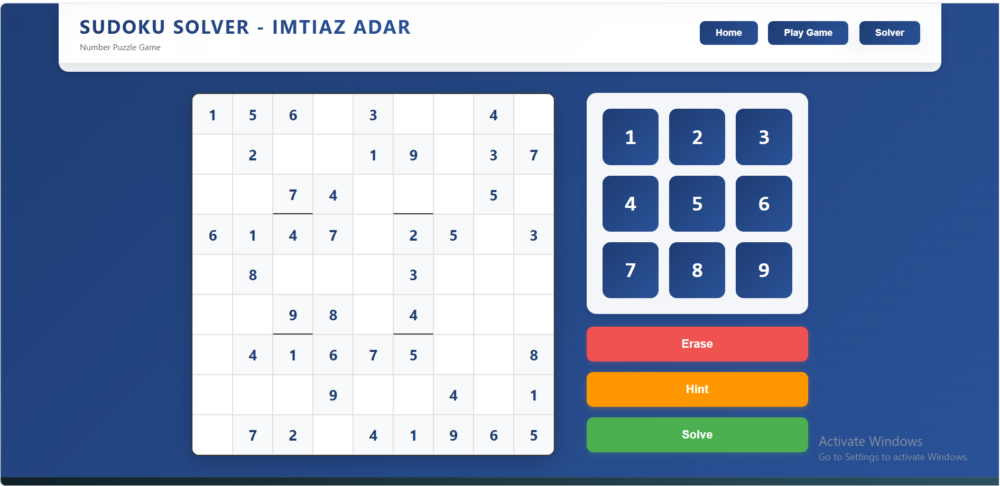

# Sudoku Game - Number Puzzle Solver - Imtiaz Adar

A beautiful, responsive Sudoku game with a built-in solver, sound effects, and three difficulty levels. Built with FastAPI backend and JavaScript frontend.



# ✨ Features

- 🎮 **Three Difficulty Levels** - Easy, Medium, and Hard
- 🧩 **Random Puzzle Generation** - Every new game is unique
- 🔢 **Smart Solver** - Automatically solves any valid Sudoku puzzle
- 💡 **Hint System** - 3 hints per game to help you out
- ❌ **Mistake Counter** - Tracks invalid moves
- 🔴 **Conflict Highlighting** - Shows conflicting numbers in red
- 🔊 **Sound Effects** - Move, win, and lose sounds
- 📱 **Fully Responsive** - Works perfectly on phones, tablets, and desktops
- 🎨 **Modern UI** - Beautiful gradient design with smooth animations
- 👤 **Developer Footer** - Persistent footer with social links

# 🖥️ Live Demo

http://tinyurl.com/SudokuSolverImtiazAdar

# 📋 Prerequisites

- Python 3.8 or higher
- pip (Python package manager)

1. Create project structure
Make sure you have the following structure:
sudoku-game/  
├── main.py    
├── static/
│   ├── index.html  
│   ├── style.css  
│   ├── script.js  
│   └── sounds/  
│       ├── dra1.mp3  (move sound)  
│       ├── dra3.mp3  (lose sound)  
│       └── dra4.mp3  (win sound) 
        └── dra4.mp3  (win sound)  


2. Install dependencies

```
pip install fastapi uvicorn
```

3. Add sound files
Place your sound files in the static/sounds/ directory:

- dra1.mp3 - Played when placing a number

- dra3.mp3 - Played when making a mistake

- dra4.mp3 - Played when winning/solving

- dra5.mp3 - Played when about to lose

4. Run the application
```
uvicorn main:app --reload --host 0.0.0.0 --port 8000
```
5. Open in browser
```
Navigate to http://localhost:8000
```

# 🎮 How to Play
**Game Mode**  
- Click Play Game from the navigation menu

- Select a difficulty level (Easy, Medium, or Hard)

- Click on any empty cell to select it

- Press a number from the number pad to fill the cell

- Use Erase to clear a cell

- Use Hint to get help (maximum 3 hints)

- Click Check to verify your solution when all cells are filled

**Solver Mode**  
- Click Solver from the navigation menu

- Enter the numbers from your puzzle into the grid

- Click Solve to get the solution instantly

- Use Clear to reset the board

# 🎯 Difficulty Levels
|Difficulty|Empty Cells|Cells Pre-filled|
|----------|-----------|----------------|
|Easy|40|41|
|Medium|55|26|  
|Hard|65|16|  

# 📱 Responsive Design
The game adapts to different screen sizes:

- Mobile (<768px) - Number pad below the board for easy thumb access

- Tablet (768px-1024px) - Number pad beside the board as 3x3 grid

- Desktop (>1024px) - Number pad beside the board with larger buttons

# 🛠️ API Endpoints
|Endpoint|Method|Description|
|--------|------|-----------|  
|/api/new-puzzle/{difficulty}|GET|Generate a new random Sudoku puzzle| 
|/api/solve|POST|Solve a Sudoku puzzle|  
|/api/validate|POST|Validate a move and return conflicts|  

**Example API Response**
GET /api/new-puzzle/easy  
```
json
{
  "board": [[...]],
  "solution": [[...]],
  "fixedCells": [[...]],
  "difficulty": "easy"
}
```
# 🎨 Customization
- Change Colors

- Edit static/style.css to customize the color scheme:
```
css
/* Change gradient background */
body {
    background: linear-gradient(135deg, #your-color-1, #your-color-2);
}

/* Change button colors */
.difficulty-btn.easy {
    background: linear-gradient(135deg, #color1, #color2);
}
```
- Change Sound Effects
Replace the MP3 files in static/sounds/ with your own:

- Keep the same filenames or update them in script.js

# 📂 Project Structure
```
sudoku-game/  
├── main.py                 # FastAPI backend with Sudoku logic  
├── static/  
│   ├── index.html         # Main HTML structure  
│   ├── style.css          # All styling and responsive   CSS  
│   ├── script.js          # Frontend JavaScript logic  
│   └── sounds/            # Sound effects  
│       ├── dra1.mp3  
│       ├── dra3.mp3  
│       └── dra4.mp3  
|       └── dra4.mp3   
└── README.md              # This file  
```


# 👨‍💻 Developer
**Imtiaz Adar [LinkedIn](www.linkedin.com/in/imtiaz-ahmed-adar)**

**X (Twitter): @imtiazaadar**


# 🙏 Acknowledgments
- FastAPI framework

- FontAwesome for icons

- Google Fonts for Inter font